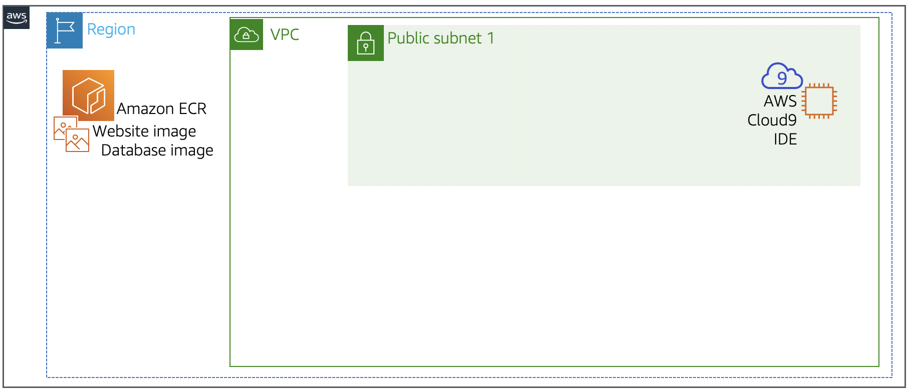
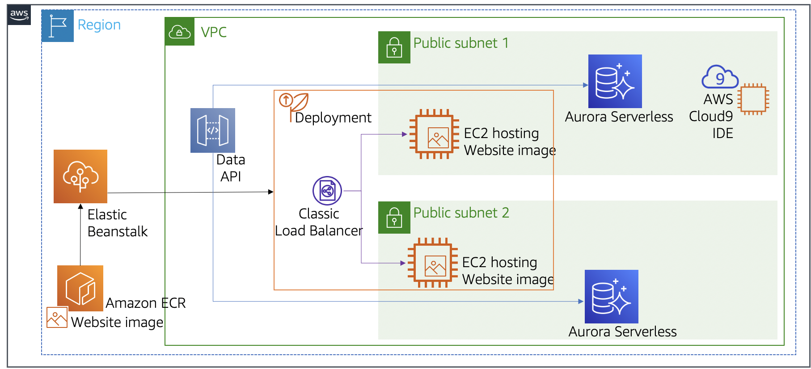

# aws-dev-Running_Containers_on_a_Managed_Service
Running Containers on a Managed Service

## about the lab

In this lab we deployed the application using two managed cloud services.
and the database tier using Amazon Aurora Serverless and the web tier using AWS Elastic Beanstalk.
knowing that we didn't use much code, because most of our work was on the AWS Managment Console

## Lab initial state

## Lab final state

